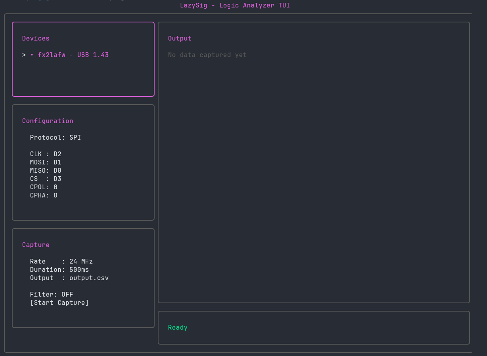

# LazySig

A lazygit-inspired terminal UI for quickly capturing and analyzing SPI/I2C/UART bus data using sigrok and fx2lafw-compatible logic analyzers.

## Features

- **Modern panel-based TUI** - Lazygit-inspired interface with bordered panels
- **Multiple protocol support** - SPI, I2C, and UART
- **Multi-device support** - Automatic detection and selection of connected analyzers
- **Quick keyboard shortcuts** - One-key access to common operations
- **Configurable sample rates** - 48 MHz down to 1 MHz with custom option
- **Hardware triggering** - CS falling edge for SPI
- **CSV output** - Decoded protocol data with timestamps
- **Frame filtering** - Optional removal of empty data frames
- **Live output preview** - View captured data directly in the UI

## Requirements

### Hardware
- fx2lafw-compatible logic analyzer (e.g., Saleae Logic clone, DSLogic)
- Connection to target device's SPI or I2C bus

### Software
- **sigrok-cli** - Command-line interface for sigrok
  ```bash
  # Ubuntu/Debian
  sudo apt install sigrok-cli

  # Fedora
  sudo dnf install sigrok-cli

  # macOS
  brew install sigrok-cli
  ```

- **Go 1.21+** - For building from source
  ```bash
  # Ubuntu/Debian
  sudo apt install golang-go

  # Fedora
  sudo dnf install golang

  # macOS
  brew install go
  ```

### Logic Analyzer Setup
Ensure your logic analyzer is detected by sigrok:
```bash
sigrok-cli --scan
```

You should see output like:
```
The following devices were found:
fx2lafw:conn=1.43 - fx2lafw - fx2lafw
```

## Installation

### Option 1: Using Make (Recommended)

```bash
# Clone the repository
git clone https://github.com/yourusername/lazysig.git
cd lazysig

# Install system-wide (requires sudo)
make install

# OR install to ~/.local/bin (no sudo required)
make install-user
```

### Option 2: Manual Build

```bash
# Clone the repository
git clone https://github.com/yourusername/lazysig.git
cd lazysig

# Build and install
go build -o lazysig
sudo mv lazysig /usr/local/bin/

# OR just build and run locally
go build -o lazysig
./lazysig
```

### Option 3: Go Install (if published)

```bash
go install github.com/yourusername/lazysig@latest
```

### Available Make Targets

```bash
make build        # Build the binary
make install      # Install to /usr/local/bin (requires sudo)
make install-user # Install to ~/.local/bin (no sudo)
make clean        # Remove build artifacts
make run          # Build and run
make help         # Show all targets
```

## Usage

### Quick Start

```bash
lazysig
```

### Interface Layout



### Keyboard Shortcuts

#### Quick Actions
- **s** - Start capture immediately
- **f** - Toggle frame filtering
- **d** - Jump to duration selector
- **q** - Quit application

#### Navigation
- **Tab/Shift+Tab** - Cycle through panels
- **1-5** - Jump directly to panel (1=Devices, 2=Config, 3=Capture, 4=Output, 5=Status)
- **↑↓ or j/k** - Navigate within panel
- **Enter** - Select/Edit field
- **Esc** - Cancel edit

### Configuration

1. **Select Device** (Panel 1)
   - Auto-detects connected logic analyzers
   - Press Enter to select

2. **Configure Protocol** (Panel 2)
   - Press Enter on "Protocol" to cycle: SPI → I2C → UART
   - Configure pins for selected protocol:
     - **SPI**: CLK, MOSI, MISO, CS, CPOL, CPHA
     - **I2C**: SDA, SCL, Address
     - **UART**: TX, RX, Baud Rate

3. **Set Capture Settings** (Panel 3)
   - **Sample Rate**: 48 MHz to 1 MHz (or custom)
   - **Duration**: Presets (2s, 1s, 500ms, 250ms) or custom
   - **Output File**: CSV filename
   - **Filter**: Toggle empty frame filtering
   - Press Enter on "Start Capture" or press **s** anywhere

4. **View Output** (Panel 4)
   - Live preview of captured data
   - Full data saved to CSV file

## Output Format

### SPI CSV
```csv
time,mosi,miso
0.000000042,88,00
0.000000125,00,E4
```

### I2C CSV
```csv
time,scl,sda
0.000000042,Start,
0.000000125,Address write: 50,
```

### UART CSV
```csv
time,tx,rx
0.000000042,48,
0.000000125,,65
```

## Default Pin Mappings

- **D0-D7**: Physical channel pins on fx2lafw device
- **SPI**: CLK=D2, MOSI=D1, MISO=D0, CS=D3
- **I2C**: SDA=D0, SCL=D1
- **UART**: TX=D0, RX=D1

All pins are configurable through the UI.

## Troubleshooting

**Logic analyzer not detected:**
```bash
# Check USB permissions
sudo usermod -aG plugdev $USER
# Log out and back in

# Verify device
lsusb | grep -i fx2
```

**No data captured:**
- Verify pin connections to target device
- Check trigger is appropriate (CS falling edge for SPI)
- Ensure target device is active during capture window
- Increase capture duration
- Try higher sample rate (8 MHz minimum recommended for most protocols)

**Sample rate issues:**
- Use 8 MHz or higher for reliable decoding
- For high-speed protocols (>1 MHz), use 24-48 MHz
- Lower sample rates may miss edges or decode incorrectly

**Permission errors:**
```bash
# Add udev rules for fx2lafw
sudo cp /usr/share/sigrok-firmware-fx2lafw/60-libsigrok.rules /etc/udev/rules.d/
sudo udevadm control --reload-rules
sudo udevadm trigger
```

## Tips

- **Quick workflow**: Press `1` to select device, `2` to set protocol, `3` to configure capture, then `s` to start
- **Custom values**: Select "Custom..." in dropdowns to enter any value
- **Panel navigation**: Use number keys (1-5) to jump directly to any panel
- **Frame filtering**: Enable with `f` to remove empty/noise frames from SPI captures

## Project Structure

```
LazySig/
├── main.go      # TUI interface and event handling
├── panels.go    # Panel rendering functions
├── capture.go   # sigrok-cli integration and decoding
├── go.mod       # Go module dependencies
└── README.md    # This file
```

## Dependencies

- [Bubble Tea](https://github.com/charmbracelet/bubbletea) - Terminal UI framework
- [Lipgloss](https://github.com/charmbracelet/lipgloss) - Terminal styling
- [sigrok-cli](https://sigrok.org/) - Logic analyzer backend

## License

MIT

## Contributing

Issues and pull requests welcome! Please ensure:
1. Code follows existing style
2. All protocols (SPI/I2C/UART) are tested
3. README is updated for new features
